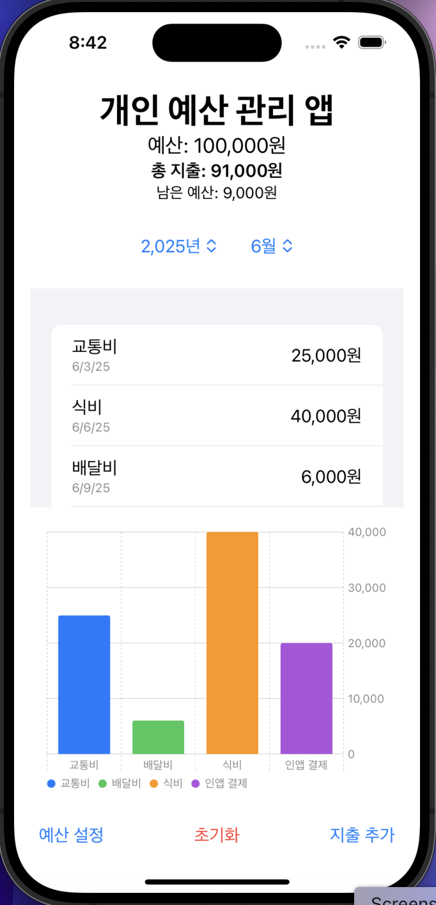
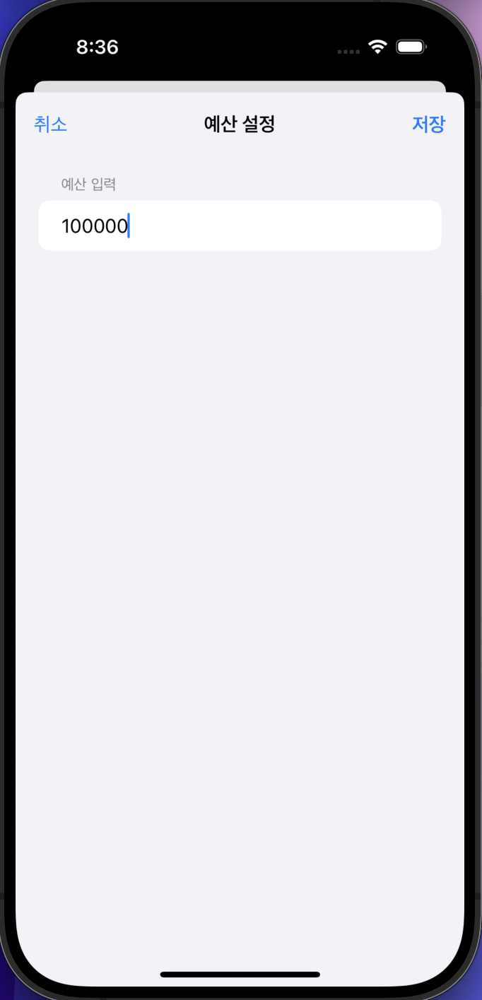
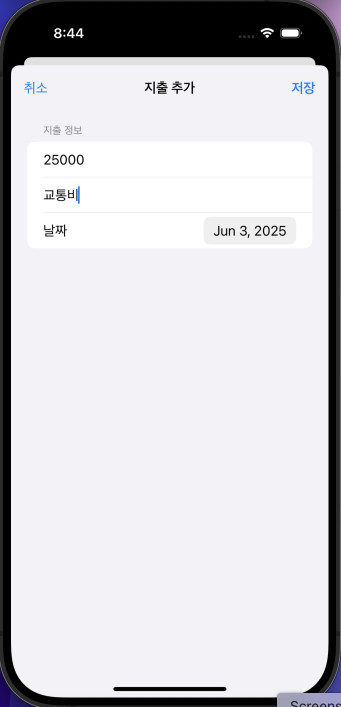
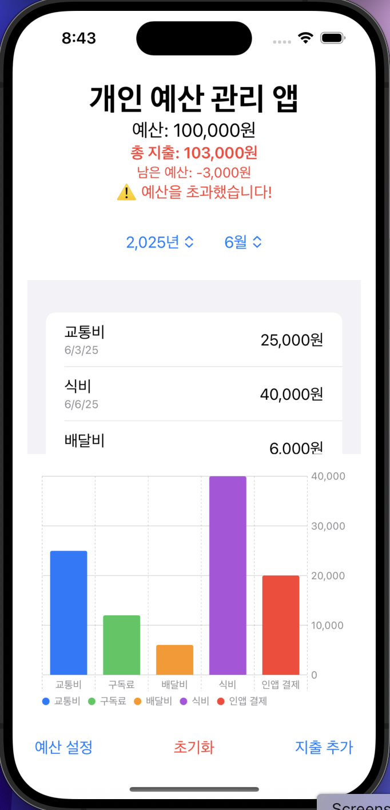

# IosProgramming Final Mini Project

## 개인 예산 관리 애플리케이션

### 1. 프로젝트 개요
  돈을 효율적으로 관리하기 위한 여러 기능을 가지고 있는 ios 애플리케이션이다. 
  사용자가 앱을 통하여 간편하게 예산과 지출을 관리할 수 있도록 하는 것을 목표로 한다.
### 2. 프로젝트 기능
- 예산 설정 : 한달 동안 사용 가능한 예산을 설정할 수 있는 기능이다.
- 지출 등록 : 금액, 카테고리 등의 지출 내용을 등록할 수 있는 기능이다.
- 월별 통계 : 월간 카테고리별 지출 분포를 그래프 형태로 한눈에 파악할 수 있다.
- 기타 편의 기능 : 간편한 수정/삭제, 초기화 기능과 경고알림 기능이다.
### 3. 프로젝트 결과
- 메인 화면   
- 예산 설정   
- 지출 등록   
- 경고 알림   
### 4. 기대 효과
- 사용자는 월별 예산을 설정하고 실시간으로 지출 내역과 남은 예산을 확인함으로써, 자신의 소비 패턴을 인식하고 불필요한 지출을 줄일 수 있다.
- 월별 통계 및 카테고리별 지출 차트를 통해 자신의 지출 트렌드를 직관적으로 파악할 수 있어, 합리적인 소비 결정을 내리는 데 도움이 된다.
- 복잡한 재무 앱과 달리, 간단한 인터페이스를 통해 누구나 쉽게 지출을 기록하고 예산을 관리할 수 있어, 꾸준한 사용으로 건전한 자산 관리 습관을 기를 수 있다.
### 5. 관련 기술
- Swift : Apple이 2014년에 발표한 범용 프로그래밍 언어다. Objective-C의 복잡함을 줄이고 간결하고 안전하며 현대적인 언어를 목표로 개발되었으며 iOS, macOS, watchOS, tvOS 등의 Apple 플랫폼 앱 개발에 사용된다.
### 6. 개발 도구
- Xcode : Apple의 공식 개발 도구로, Swift 코드 작성, UI 디자인, 시뮬레이터 테스트 등을 통합적으로 수행할 수 있다. 프로젝트 빌드, 디버깅, 실기기 배포에도 활용된다.
### 7. 소개 영상
  유튜브 동영상

  
